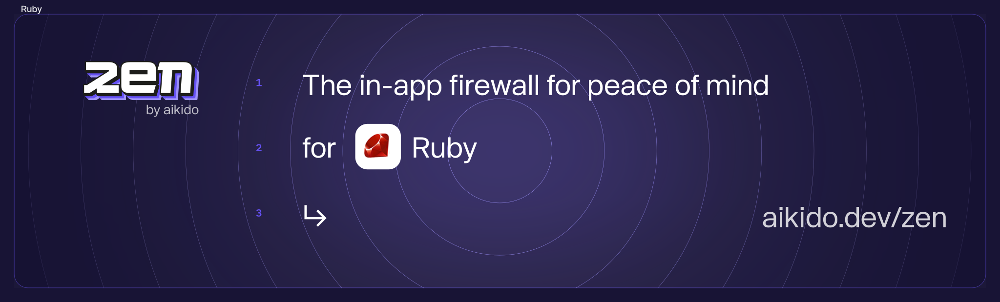

# Zen, in-app firewall for Ruby | by Aikido

[](https://badge.fury.io/rb/aikido-zen)
[](http://makeapullrequest.com)
[](https://github.com/AikidoSec/firewall-ruby/actions/workflows/main.yml)
[](https://github.com/AikidoSec/firewall-ruby/actions/workflows/release.yml)
[](https://codecov.io/gh/AikidoSec/firewall-ruby)

Zen, your in-app firewall for peace of mind - at runtime.

Zen by Aikido is an embedded Web Application Firewall that autonomously protects Ruby apps against common and critical attacks.

It protects your Ruby apps by preventing user input containing dangerous strings, which allow injection, pollution, and path traversal attacks. It runs on the same server as your Ruby app for simple [installation](#installation) and zero maintenance.

## Features

Zen will autonomously protect your Ruby applications against:

* 🛡️ [SQL injection attacks](https://www.aikido.dev/blog/the-state-of-sql-injections)
* 🛡️ [Server-side request forgery (SSRF)](https://github.com/AikidoSec/firewall-node/blob/main/docs/ssrf.md)
* 🛡️ [Command injection attacks](https://www.aikido.dev/blog/command-injection-in-2024-unpacked)
* 🛡️ [Path traversal attacks](https://www.aikido.dev/blog/path-traversal-in-2024-the-year-unpacked)
* 🛡️ [NoSQL injection attacks](https://www.aikido.dev/blog/web-application-security-vulnerabilities) (coming soon)
* 🛡️ [Attack waves](https://help.aikido.dev/zen-firewall/zen-features/attack-wave-protection)

Zen operates autonomously on the same server as your Ruby app to:

* ✅ Secure your app like a classic web application firewall (WAF), but with none of the infrastructure or cost
* ✅ Rate limit specific API endpoints by IP or by user
* ✅ Allow you to block specific users manually

## Supported libraries and frameworks

Zen for Ruby 2.7+ is compatible with:

### Web frameworks

* ✅ [Ruby on Rails](docs/rails.md) 7.x, 8.x

### Application servers

* ✅ [Puma](https://puma.io/)

Our test suite only covers Puma. If you use another Rack server, [contact us](docs/troubleshooting.md#contact-support) and we'll help check whether Zen is compatible.

### Database drivers

* ✅ [`sqlite3`](https://github.com/sparklemotion/sqlite3-ruby) 1.x, 2.x
* ✅ [`pg`](https://github.com/ged/ruby-pg) 1.x
* ✅ [`mysql2`](https://github.com/brianmario/mysql2) 0.x
* ✅ [`trilogy`](https://github.com/trilogy-libraries/trilogy) 2.x

### ORMs and query builders

See list above for supported database drivers.

* ✅ [ActiveRecord](https://github.com/rails/rails)
* ✅ [Sequel](https://github.com/jeremyevans/sequel)

### HTTP clients

* ✅ [`net-http`](https://github.com/ruby/net-http)
* ✅ [`http.rb`](https://github.com/httprb/http) 1.x, 2.x, 3.x, 4.x, 5.x
* ✅ [`httpx`](https://gitlab.com/os85/httpx) 1.x (1.1.3+)
* ✅ [`httpclient`](https://github.com/nahi/httpclient) 2.x, 3.x
* ✅ [`excon`](https://github.com/excon/excon) 0.x (0.50.0+), 1.x
* ✅ [`curb`](https://github.com/taf2/curb) 0.x (0.2.3+), 1.x
* ✅ [`patron`](https://github.com/toland/patron) 0.x (0.6.4+)
* ✅ [`typhoeus`](https://github.com/typhoeus/typhoeus) 0.x (0.5.0+), 1.x
* ✅ [`async-http`](https://github.com/socketry/async-http) 0.x (0.70.0+)
* ✅ [`em-http-request`](https://github.com/igrigorik/em-http-request) 1.x

## Installation

We recommend testing Zen locally or on staging before deploying to production.

```sh
bundle add aikido-zen
```

or, if not using bundler:

```sh
gem install aikido-zen
```

For framework specific instructions, check out our docs:

* [Ruby on Rails](docs/rails.md)

## Reporting to your Aikido Security dashboard

> Aikido is your no nonsense application security platform. One central system that scans your source code & cloud, shows you what vulnerabilities matter, and how to fix them - fast. So you can get back to building.

Zen is a new product by Aikido. Built for developers to level up their security. While Aikido scans, get Zen for always-on protection.

You can use some of Zen's features without Aikido, of course. Peace of mind is just a few lines of code away.

But you will get the most value by reporting your data to Aikido.

You will need an Aikido account and a token to report events to Aikido. If you don't have an account, you can [sign up for free](https://app.aikido.dev/login).

Here's how:

* [Log in to your Aikido account](https://app.aikido.dev/login).
* Go to [Zen](https://app.aikido.dev/runtime/services).
* Go to apps.
* Click on **Add app**.
* Choose a name for your app.
* Click **Generate token**.
* Copy the token.
* Set the token as an environment variable, `AIKIDO_TOKEN`, using [dotenv](https://github.com/bkeepers/dotenv) or another method of your choosing.

## Running in production (blocking) mode

By default, Zen will only detect and report attacks to Aikido.

To block requests, set the `AIKIDO_BLOCK` environment variable to `true`.

See [Reporting to Aikido](#reporting-to-your-aikido-security-dashboard) to learn how to send events to Aikido.

## Additional configuration

[Configure Zen using environment variables for authentication, mode settings, debugging, and more.](https://help.aikido.dev/doc/configuration-via-env-vars/docrSItUkeR9)

## License

This program is offered under a commercial and under the AGPL license. You can be released from the requirements of the AGPL license by purchasing a commercial license. Buying such a license is mandatory as soon as you develop commercial activities involving the Zen software without disclosing the source code of your own applications. 

For more information, please contact Aikido Security at this address: support@aikido.dev or create an account at https://app.aikido.dev.

## Benchmarks

We run a benchmark on every commit to ensure Zen has a minimal impact on your application's performance.

See [benchmarks](benchmarks)

## Bug bounty program

Our bug bounty program is public and can be found by all registered Intigriti users at: https://app.intigriti.com/researcher/programs/aikido/aikidozenbeta

## Contributing

See [CONTRIBUTING.md](.github/CONTRIBUTING.md) for more information.

## Code of Conduct

See [CODE_OF_CONDUCT.md](.github/CODE_OF_CONDUCT.md) for more information.

## Security

See [SECURITY.md](.github/SECURITY.md) for more information.
